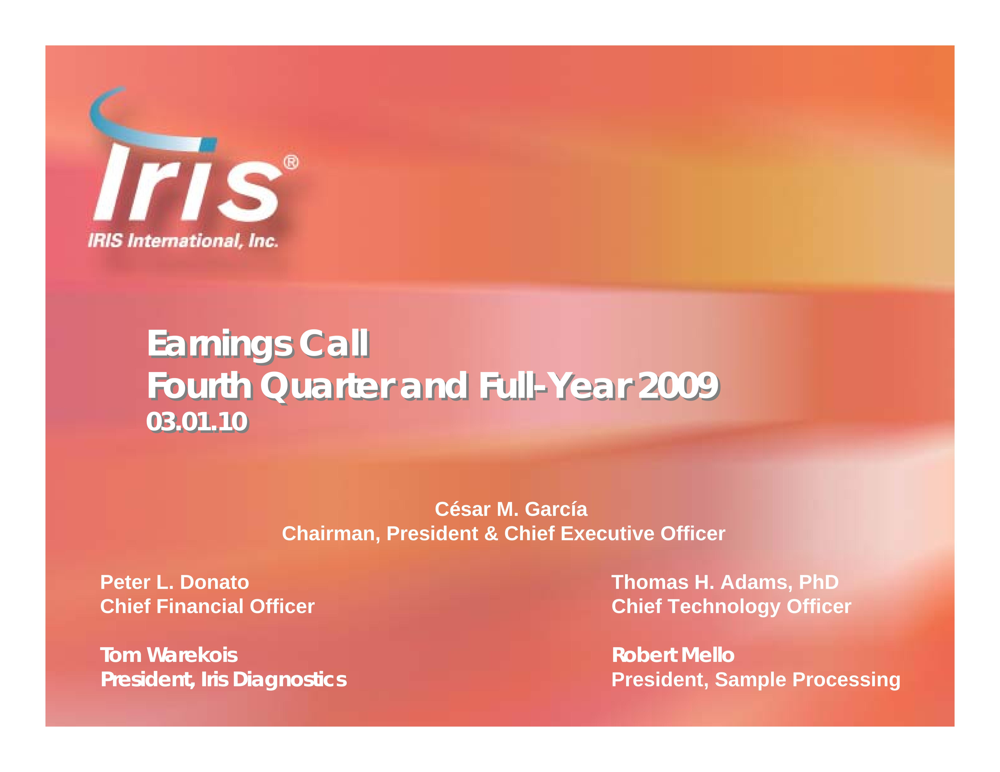
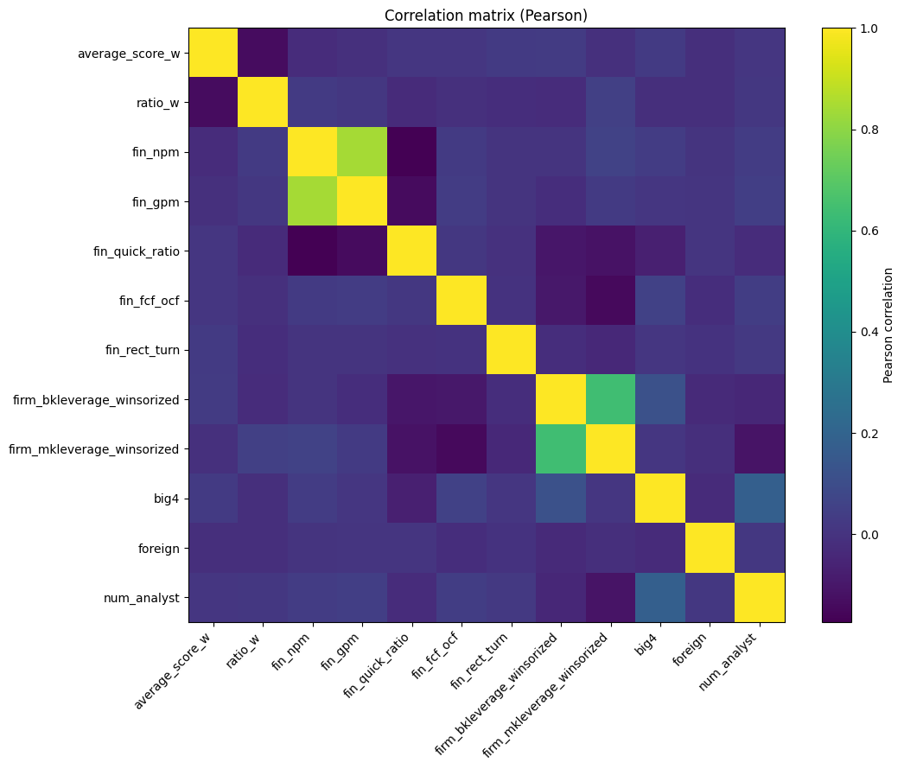

# Multimodal AI Pipeline for ESG Signal Detection in Corporate Earnings Slides

A research pipeline that uses **Google Gemini 2.5 Flash** and **OpenAI GPT-4.1-mini** vision models to automatically detect and classify ESG/CSR content in corporate earnings presentation slides — then tests whether that ESG signal predicts stock market reactions.

---

## The Research Question

> Do companies that include more ESG/sustainability content in their earnings call presentations see a different stock market reaction after those calls?

ESG (Environmental, Social, Governance) investing is a growing field worth trillions of dollars. But most research focuses on annual reports and press releases. This project asks: **what about the slide decks companies show investors during live earnings calls?**

We built a pipeline to automatically scan 500+ corporate presentations (14,000+ individual slides) from Fortune 500 companies across 2010–2022, classify each slide for ESG content using AI vision models, and then statistically test whether that ESG signal correlates with stock returns (measured as Cumulative Abnormal Returns using Fama-French factor models).

---

## Pipeline Architecture

```
┌─────────────────────────────────────────────────────────────────────────┐
│                        STEP 1: Data Preparation                         │
│  Corporate PDF Slides ──► convert_pdf_to_images.py ──► Slide JPEGs      │
└─────────────────────────────────────────────────────────────────────────┘
                                    │
                                    ▼
┌─────────────────────────────────────────────────────────────────────────┐
│                        STEP 2: Vision Analysis                          │
│  Slide JPEGs ──► analyze_gemini.py / analyze_openai.py                  │
│                                                                         │
│  Per-slide classification:                                              │
│    • CSR-related?     Yes / No                                          │
│    • Category?        CSR Forward / CSR Summary / Others                │
│    • ESG Domain?      Environmental / Social / Governance / Mixed       │
│                                                                         │
│  Output: JSONL with one record per presentation                         │
└─────────────────────────────────────────────────────────────────────────┘
                                    │
                                    ▼
┌─────────────────────────────────────────────────────────────────────────┐
│                        STEP 3: Feature Aggregation                      │
│  JSONL results ──► merge_results.py ──► Per-presentation feature table  │
│                                                                         │
│  Features: csr_ratio, env_ratio, soc_ratio, gov_ratio,                  │
│            csr_forward_ratio, csr_summary_ratio, ...                    │
└─────────────────────────────────────────────────────────────────────────┘
                                    │
                                    ▼
┌─────────────────────────────────────────────────────────────────────────┐
│                        STEP 4: Statistical Analysis                     │
│  CSR features + CAR data ──► regression.py ──► OLS results              │
│                                                                         │
│  Controls: 40+ financial fundamentals, year FE, industry FE             │
│  Standard errors: HC3 heteroskedasticity-robust                         │
└─────────────────────────────────────────────────────────────────────────┘
                                    │
                                    ▼
┌─────────────────────────────────────────────────────────────────────────┐
│                    STEP 5: Fine-Tuning (Optional)                       │
│  Labeled slides ──► prepare_finetune_dataset.py ──► Training JSONL      │
│  Training JSONL ──► finetune_vlm.py ──► Fine-tuned VLM                  │
│                                                                         │
│  Backends: OpenAI fine-tuning API  |  HuggingFace + PEFT/LoRA           │
└─────────────────────────────────────────────────────────────────────────┘
```

---

## Example Output

### Input: Raw Presentation Slide


*A raw slide image as input to the Gemini Vision API. The model analyzes visual content — imagery, text, and symbols — to detect CSR messaging.*

### Output: ESG Correlation Analysis


*Pearson correlation matrix between CSR feature ratios and stock return metrics.*



*Heatmap showing the relationship between visual ESG signals and financial variables across the full dataset.*

---

## Technical Stack

| Component | Technology |
|-----------|-----------|
| Vision Analysis | Google Gemini 2.5 Flash, OpenAI GPT-4.1-mini |
| PDF Rendering | PyMuPDF (fitz), pdf2image |
| Data Processing | pandas, numpy |
| Statistical Analysis | statsmodels (OLS, HC3 robust SEs) |
| VLM Fine-tuning | PEFT/LoRA, trl SFTTrainer, bitsandbytes |
| Open-source VLM | Qwen2-VL-2B-Instruct |
| Environment | Python 3.10+, CUDA GPU (for fine-tuning) |

---

## Repository Structure

```
PPT_Analysis/
├── src/
│   ├── pipeline/
│   │   ├── analyze_gemini.py           # Main: Gemini Vision CSR analysis (parameterized)
│   │   ├── analyze_openai.py           # Alternative: OpenAI GPT-4.1-mini analysis
│   │   ├── convert_pdf_to_images.py    # Preprocessing: PDF slides → JPEG images
│   │   ├── prepare_finetune_dataset.py # Build VLM fine-tuning dataset from labels
│   │   └── finetune_vlm.py            # Fine-tune a VLM (OpenAI API or HuggingFace)
│   └── analysis/
│       ├── merge_results.py            # Aggregate CSR features + merge with financial data
│       └── regression.py              # OLS regression utilities
│
├── notebooks/
│   └── analysis_overview.ipynb        # End-to-end walkthrough of the pipeline
│
├── examples/
│   ├── slides/slide_page_1.jpg        # Example input slide
│   └── results/                       # Visualization outputs
│       ├── correlation_heatmap.png
│       ├── pearson_correlation.png
│       ├── event_study_car.png
│       └── event_study_variant.png
│
├── data/                              # Local data directory (gitignored)
├── .env.example                       # API key template
├── requirements.txt
└── README.md
```

---

## Setup & Usage

### 1. Clone and install dependencies

```bash
git clone https://github.com/MuntasirTiash/PPT-Analysis.git
cd PPT-Analysis
pip install -r requirements.txt
```

### 2. Configure API keys

```bash
cp .env.example .env
# Edit .env and fill in your Gemini and/or OpenAI API keys
```

### 3. (Optional) Convert PDFs to slide images

Only needed if using `analyze_openai.py`, which requires pre-rendered images.
`analyze_gemini.py` renders PDFs on the fly.

```bash
python src/pipeline/convert_pdf_to_images.py \
    --input-dir /path/to/pdfs \
    --output-dir /path/to/images \
    --dpi 300
```

### 4. Run CSR analysis with Gemini

```bash
# Analyze presentations from a specific year
python src/pipeline/analyze_gemini.py \
    --year 2018 \
    --car-path /data/CAR/3factor_post4_13.csv

# Without financial data filtering:
python src/pipeline/analyze_gemini.py \
    --year 2022 \
    --no-filter \
    --pdf-dir /data/ppt_2022
```

### 5. Aggregate features and merge with financial data

```bash
python src/analysis/merge_results.py \
    --json-path /results/final_csr_analysis_2018.json \
    --car-path /data/CAR/3factor_post4_13.csv \
    --index-path /data/index/data(mp3+ppt)_2018.xlsx \
    --output-csv /results/merged_2018.csv
```

### 6. Run regression analysis

```bash
python src/analysis/regression.py \
    --data /results/merged_2018.csv \
    --y-var 3factor_post4_13 \
    --x-var csr_ratio \
    --robust
```

### 7. Build fine-tuning dataset

```bash
python src/pipeline/prepare_finetune_dataset.py \
    --results-jsonl /results/final_csr_analysis_2018.json \
    --images-dir /data/CSR/images \
    --output-dir ./finetune_data \
    --format huggingface
```

### 8. Fine-tune a VLM

```bash
# Option A: OpenAI hosted fine-tuning (no GPU required)
python src/pipeline/finetune_vlm.py \
    --backend openai \
    --train-jsonl finetune_data/train.jsonl \
    --val-jsonl finetune_data/val.jsonl

# Option B: Open-source VLM with LoRA (GPU required)
python src/pipeline/finetune_vlm.py \
    --backend huggingface \
    --base-model Qwen/Qwen2-VL-2B-Instruct \
    --train-jsonl finetune_data/train.jsonl \
    --val-jsonl finetune_data/val.jsonl \
    --output-dir ./finetuned_csr_model \
    --epochs 3
```

---

## Dataset Scale

| Dimension | Value |
|-----------|-------|
| Presentations analyzed | 500+ |
| Slides classified | 14,000+ |
| Years covered | 2010 – 2022 |
| Company universe | Fortune 500 |
| Financial variables | 100+ fundamentals per company-year |
| CSR features extracted | csr_ratio, env_ratio, soc_ratio, gov_ratio, forward_ratio, summary_ratio |

---

## Research Context

**Event Study Methodology**: Stock market reactions are measured as Cumulative Abnormal Returns (CAR) using event windows around earnings call dates (e.g., [+4, +13] trading days). Abnormal returns are benchmarked against Fama-French 3-factor and 4-factor models to control for market-wide and style exposures.

**Why visual ESG signals?** Most ESG research analyzes text (10-K filings, sustainability reports). Presentation slides are a high-stakes visual channel where companies can selectively emphasize ESG messaging to investors — making them an interesting signal to study separately.

**CSR Forward vs. Summary**: We distinguish between *forward-looking* ESG slides (goals, targets, pledges) and *backward-looking* ones (past achievements, historical performance). Theory suggests forward-looking messaging may have a stronger signaling effect.

---

## Data Availability

Raw presentation PDFs, audio files, and financial data are not included in this repository due to file size and data licensing constraints. The code, methodology, and analysis outputs are available here. The dataset is available upon request for academic collaboration.

---

## Author

**Muntasir Shohrab**
[GitHub](https://github.com/MuntasirTiash)
